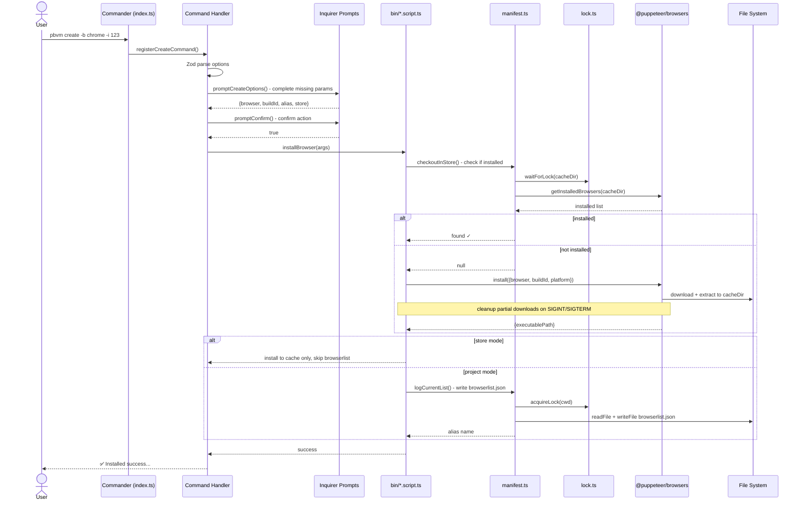

# pbvm


A browser version manager built on `@puppeteer/browsers`, unified management of multiple versions of Chrome, Chromium, and Firefox.

[](https://www.npmjs.com/package/pbvm-cli)
[](LICENSE)
[](https://github.com/cgfeel/pbvm/actions/workflows/pr-check.yml)

📖 [Online Docs](https://cgfeel.github.io/pbvm/) | [中文文档](./README.zh-CN.md)

## Features

- **Multi-browser support** — Chrome, Chromium, Firefox: one-click download and switch
- **Version aliases** — Give any version a semantic alias (e.g., `mobile-test`, `bug-repro`), say goodbye to memorizing Build IDs
- **Cross-platform** — Unified command interface for macOS, Linux, and Windows
- **Interactive prompts** — Automatically triggers interactive prompts when parameters are missing, no need to memorize command formats
- **Monorepo-friendly** — Project-level `browserlist.json` manifest lets teams share the same browser configuration
- **Local cache** — Downloaded browsers are cached in the store directory for instant reuse across projects
- **Programmatic API** — Provides both CLI and `launchBrowser()` API for integration into automation scripts

## Quick Start

**Requirements:** Node.js ≥ 22

```bash
# Install globally
npm install -g pbvm-cli

# Download your first browser
pbvm create

# List installed browsers
pbvm ls
```

## Commands

| Command        | Description                                      |
| -------------- | ------------------------------------------------ |
| `pbvm create`  | Download and install a browser                   |
| `pbvm ls`      | List browsers installed for the current project  |
| `pbvm store`   | View locally cached browsers                     |
| `pbvm open`    | Launch a specified browser                       |
| `pbvm info`    | View detailed browser information                |
| `pbvm alias`   | Set / modify browser alias                       |
| `pbvm search`  | Check for available remote versions              |
| `pbvm remove`  | Delete a browser                                 |
| `pbvm clear`   | Clear browser user data (cookies, history, etc.) |
| `pbvm restore` | Reinstall a browser                              |

All commands enter interactive selection mode when parameters are missing — no need to memorize CLI options.

## Sources & Mirrors

`create` / `search` requires a `buildId`. Different browsers can be looked up through the following sources:

| Browser  | Build ID Format   | Example          | Lookup Sources                                                                                                                                                                 |
| -------- | ----------------- | ---------------- | ------------------------------------------------------------------------------------------------------------------------------------------------------------------------------ |
| Chrome   | 4-segment version | `134.0.6998.35`  | [Chrome for Testing](https://googlechromelabs.github.io/chrome-for-testing/known-good-versions-with-downloads.json) · [Puppeteer Mapping](https://pptr.dev/supported-browsers) |
| Chromium | Numeric revision  | `1435764`        | [Chromium Dash](https://chromiumdash.appspot.com/home) · [Snapshot Index](https://commondatastorage.googleapis.com/chromium-browser-snapshots/index.html)                      |
| Firefox  | `channel_version` | `stable_136.0.0` | [Mozilla Archive](https://archive.mozilla.org/pub/firefox/)                                                                                                                    |

Speed up downloads via the [npmmirror](https://registry.npmmirror.com/binary.html?path=chrome-for-testing/) mirror:

```bash
pbvm mirror -s npmmirror      # Enable globally
pbvm mirror -s npmmirror -i   # Current project only
```

See [Sources & Mirrors docs](https://cgfeel.github.io/pbvm/source).

## Programmatic API

```ts
import { launchBrowser } from 'pbvm-cli'

// Launch by alias
await launchBrowser({ target: 'mobile-test', url: 'https://example.com' })

// Launch by buildId
await launchBrowser({ target: 'chrome@130.0.6723.116' })
```

## CLI Command Flow



## License

```
  ██████╗ ██████╗ ██╗   ██╗███╗   ███╗
  ██╔══██╗██╔══██╗██║   ██║████╗ ████║
  ██████╔╝██████╔╝██║   ██║██╔████╔██║
  ██╔═══╝ ██╔══██╗╚██╗ ██╔╝██║╚██╔╝██║
  ██║     ██████╔╝ ╚████╔╝ ██║ ╚═╝ ██║
  ╚═╝     ╚═════╝   ╚═══╝  ╚═╝     ╚═╝
```

MIT © [cgfeel](https://github.com/cgfeel)
