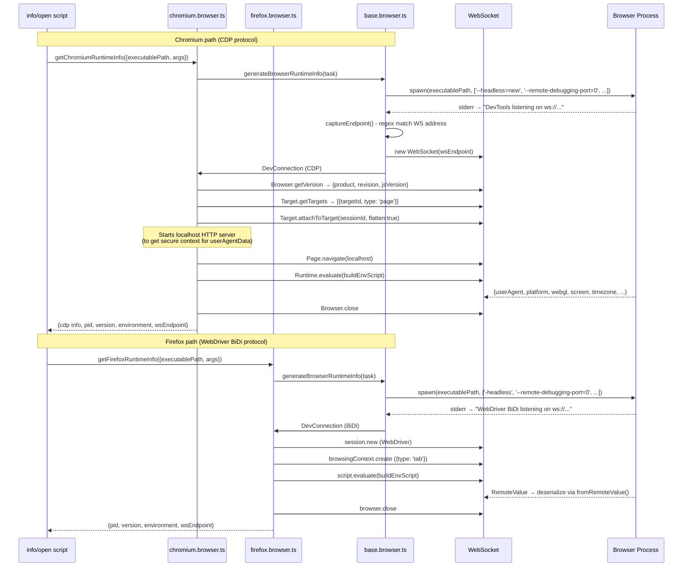

# info

View locally stored browser information and runtime information.

## Usage

```bash
pbvm info [-t <target>] [-r]
```

## Options

| Option      | Short | Description                                                   |
| ----------- | ----- | ------------------------------------------------------------- |
| `--target`  | `-t`  | Browser identifier: `{browser}@{buildId}`                     |
| `--runtime` | `-r`  | Also retrieve runtime information (starts a headless browser) |

## Static info

Always displayed:

| Field            | Description                                |
| ---------------- | ------------------------------------------ |
| `platform`       | Browser platform                           |
| `browser`        | Browser name (chrome / chromium / firefox) |
| `buildId`        | Browser version                            |
| `executablePath` | Path to the executable                     |
| `profilePath`    | Path to the user data (profile) directory  |
| `exists`         | Whether the executable exists              |
| `size`           | File size                                  |
| `createdAt`      | Install timestamp                          |

## Runtime info

When `-r` is used, pbvm starts a headless browser to collect runtime information:

- **Chrome / Chromium**: User-Agent, WebDriver endpoint, DevTools frontend URL, etc.
- **Firefox**: User-Agent, WebDriver endpoint, Gecko version, etc.

Runtime info is output in JSON format.

## Examples

```bash
# View static info
pbvm info -t chrome@134.0.6998.35

# View static + runtime info
pbvm info -t chrome@134.0.6998.35 -r

# Interactive selection
pbvm info
```

## Sample output

```
Static info:

  platform: mac_arm
  browser: chrome
  buildId: 134.0.6998.35
  executablePath: /Users/xxx/.cache/pbvm/chrome/mac_arm-134.0.6998.35/...
  profilePath: /Users/xxx/.local/share/pbvm/profiles/chrome/134.0.6998.35
  exists: true
  size: 345.2 MB
  createdAt: 2025-12-01T10:30:00.000Z

Runtime info:
The following information comes from a headless browser

{
  "userAgent": "Mozilla/5.0 ...",
  "webSocketDebuggerUrl": "ws://127.0.0.1:xxx/..."
}
```

## Runtime info collection flow

Chromium CDP / Firefox BiDi


