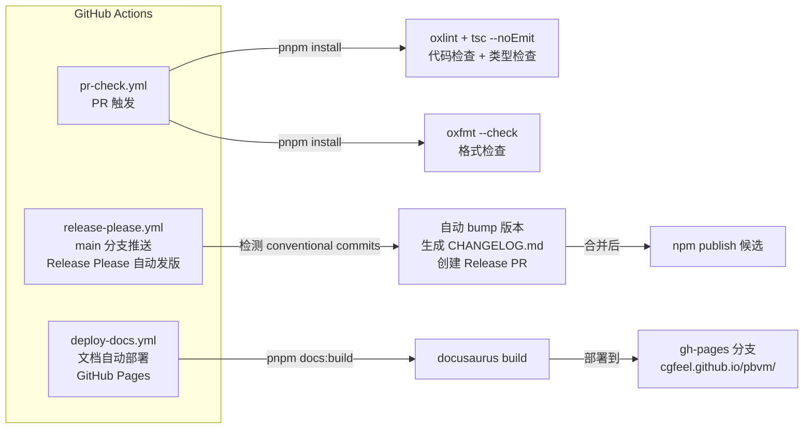

# CI/CD

```mermaid
  graph LR
      subgraph "GitHub Actions"
          PR_CHECK["pr-check.yml<br/>PR 触发"]
          RELEASE["release-please.yml<br/>main 分支推送<br/>Release Please 自动发版"]
          DEPLOY["deploy-docs.yml<br/>文档自动部署<br/>GitHub Pages"]
      end

      PR_CHECK -->|"pnpm install"| LINT["oxlint + tsc --noEmit<br/>代码检查 + 类型检查"]
      PR_CHECK -->|"pnpm install"| FORMAT["oxfmt --check<br/>格式检查"]

      RELEASE -->|"检测 conventional commits"| VERSION["自动 bump 版本<br/>生成 CHANGELOG.md<br/>创建 Release PR"]
      VERSION -->|"合并后"| NPM["npm publish 候选"]

      DEPLOY -->|"pnpm docs:build"| BUILD["docusaurus build"]
      end

      subgraph "浏览器实例"
          CHROME_EXE["chromium / chrome<br/>executablePath"]
          FF_EXE["firefox<br/>executablePath"]
          PROFILE["Profile Dir<br/>getProfileDir(browser, buildId)"]
      end

      CACHE -->|"getInstalledBrowsers()"| BROWSERLIST
      BROWSERLIST -->|"logCurrentList()"| CACHE
      LOCKFILE -->|"acquireLock()"| BROWSERLIST
      LOCKFILE -->|"acquireLock(cacheDir)"| CACHE
      CHROME_EXE -->|"--user-data-dir"| DATA
      FF_EXE -->|"--profile"| DATA

      subgraph "Firefox 额外配置"
          USER_JS["user.js<br/>禁用自动更新<br/>禁用默认浏览器检查"]
          POLICIES["policies.json<br/>企业策略硬阻断更新<br/>(distribution/ 目录下)"]
      end
      FF_EXE --> USER_JS
      FF_EXE --> POLICIES
```


