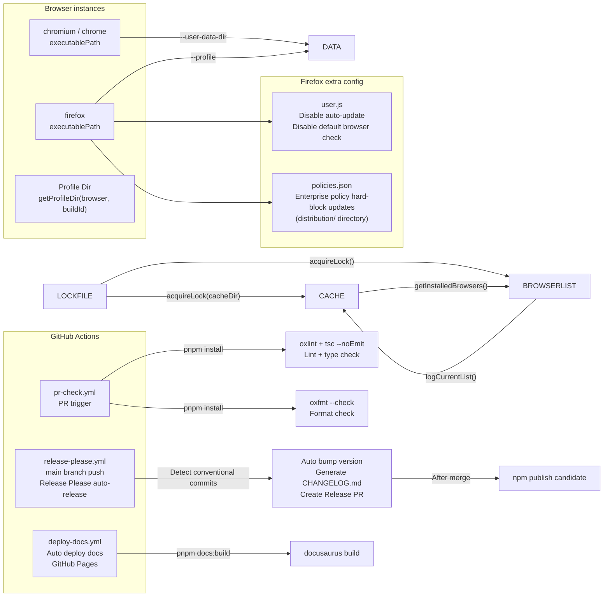
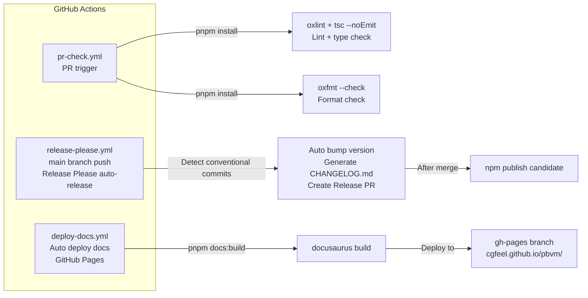

# CI/CD

```mermaid
  graph LR
      subgraph "GitHub Actions"
          PR_CHECK["pr-check.yml<br/>PR trigger"]
          RELEASE["release-please.yml<br/>main branch push<br/>Release Please auto-release"]
          DEPLOY["deploy-docs.yml<br/>Auto deploy docs<br/>GitHub Pages"]
      end

      PR_CHECK -->|"pnpm install"| LINT["oxlint + tsc --noEmit<br/>Lint + type check"]
      PR_CHECK -->|"pnpm install"| FORMAT["oxfmt --check<br/>Format check"]

      RELEASE -->|"Detect conventional commits"| VERSION["Auto bump version<br/>Generate CHANGELOG.md<br/>Create Release PR"]
      VERSION -->|"After merge"| NPM["npm publish candidate"]

      DEPLOY -->|"pnpm docs:build"| BUILD["docusaurus build"]

      subgraph "Browser instances"
          CHROME_EXE["chromium / chrome<br/>executablePath"]
          FF_EXE["firefox<br/>executablePath"]
          PROFILE["Profile Dir<br/>getProfileDir(browser, buildId)"]
      end

      CACHE -->|"getInstalledBrowsers()"| BROWSERLIST
      BROWSERLIST -->|"logCurrentList()"| CACHE
      LOCKFILE -->|"acquireLock()"| BROWSERLIST
      LOCKFILE -->|"acquireLock(cacheDir)"| CACHE
      CHROME_EXE -->|"--user-data-dir"| DATA
      FF_EXE -->|"--profile"| DATA

      subgraph "Firefox extra config"
          USER_JS["user.js<br/>Disable auto-update<br/>Disable default browser check"]
          POLICIES["policies.json<br/>Enterprise policy hard-block updates<br/>(distribution/ directory)"]
      end
      FF_EXE --> USER_JS
      FF_EXE --> POLICIES
```

```mermaid
  graph LR
      subgraph "GitHub Actions"
          PR_CHECK["pr-check.yml<br/>PR trigger"]
          RELEASE["release-please.yml<br/>main branch push<br/>Release Please auto-release"]
          DEPLOY["deploy-docs.yml<br/>Auto deploy docs<br/>GitHub Pages"]
      end

      PR_CHECK -->|"pnpm install"| LINT["oxlint + tsc --noEmit<br/>Lint + type check"]
      PR_CHECK -->|"pnpm install"| FORMAT["oxfmt --check<br/>Format check"]

      RELEASE -->|"Detect conventional commits"| VERSION["Auto bump version<br/>Generate CHANGELOG.md<br/>Create Release PR"]
      VERSION -->|"After merge"| NPM["npm publish candidate"]

      DEPLOY -->|"pnpm docs:build"| BUILD["docusaurus build"]
      BUILD -->|"Deploy to"| PAGES["gh-pages branch<br/>cgfeel.github.io/pbvm/"]
```
