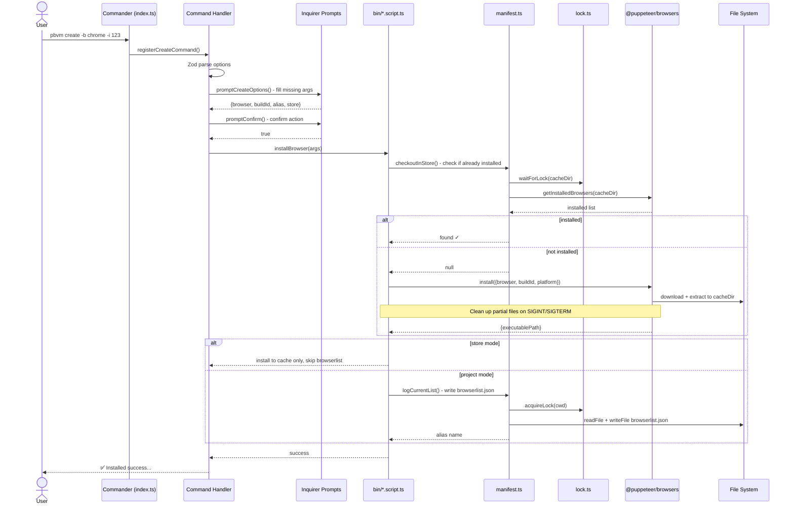

# CLI command execution flow

All pbvm commands follow a uniform three-layer processing model: **arg validation → interactive completion → script execution**.

## Request lifecycle

The diagram uses `create` as an example. All other commands follow the same flow; only the script layer implementation differs.

## Command layer (`src/commands/`)

Each command file registers with the Commander instance via `registerXxxCommand(program)` and is responsible for:

1. Defining command name, description, and option flags
2. Calling `Zod Schema` for the first layer of parsing (type validation + default value population)
3. Calling the corresponding `prompt` function to fill in args the user didn't supply (interactive mode)
4. Some commands (`create`, `remove`, `clear`) call `promptConfirm` in the action for a second confirmation
5. Passing complete args to `bin/*.script.ts` for execution

Command-to-Schema mapping:

| Command          | Schema                | Special flags             |
| ---------------- | --------------------- | ------------------------- |
| `create`         | `createBrowserSchema` | `mirror`, `rule`, `store` |
| `search`         | `createBrowserSchema` | `mirror`, `rule`          |
| `list` / `store` | `browserItemSchema`   | `all`                     |
| `remove`         | `removeBrowserSchema` | `focus`, `store`          |
| `info`           | `infoBrowserSchema`   | `runtime`                 |
| `open`           | `openBrowserSchema`   | `url`                     |
| `alias`          | `aliasBrowserSchema`  | —                         |
| `mirror`         | `mirrorSchema`        | `init`, `source`          |

## Prompt layer (`src/prompts/`)

When required args are not provided, the Prompt layer launches interactive Q&A via `@inquirer/prompts`. File responsibilities:

| File                 | Serves                            | Interactive content                                   |
| -------------------- | --------------------------------- | ----------------------------------------------------- |
| `create.prompt.ts`   | `create`, `search`                | Browser selection, buildId input, alias input         |
| `mirror.prompt.ts`   | `mirror`                          | Mirror source selection (npmmirror / disable)         |
| `alias.prompt.ts`    | `alias`                           | Alias operation type (set / remove), target selection |
| `manifest.prompt.ts` | `remove`, `info`, `open`, `clear` | Select target browser from browserlist or Store       |
| `common.prompt.ts`   | `create`, `remove`, `clear`       | Operation confirmation (confirm)                      |

## Script layer (`src/bin/`)

The script layer carries core business logic and is unaware of CLI arg formats or interactive details. Each script receives a fully validated args object, executes, and returns a result or outputs logs directly.

| Script              | Responsibility                                                         |
| ------------------- | ---------------------------------------------------------------------- |
| `install.script.ts` | Download + extract + write browserlist                                 |
| `remove.script.ts`  | Uninstall + clean browserlist + optional profile cleanup               |
| `alias.script.ts`   | Set / remove alias in browserlist                                      |
| `open.script.ts`    | Locate browser → trigger install if needed → spawn to launch           |
| `info.script.ts`    | Read install info + optionally launch headless to collect runtime info |
| `list.script.ts`    | Format and output Store / project browser lists                        |
| `search.script.ts`  | HTTP HEAD request to check remote resource availability                |
| `clear.script.ts`   | Clean Store of orphaned versions not referenced by any project         |
| `mirror.script.ts`  | Write / delete `.browsermr` config file                                |

## Concurrency control

Write operations in `manifest.ts` and `browser.lock.ts` both acquire file locks via `lock.ts`:

- **Cache directory write lock**: `acquireLock(cacheDir)` during download/uninstall — prevents concurrent processes from operating on the same file
- **browserlist.json write lock**: `acquireLock(cwd)` when writing the project manifest — prevents data loss from concurrent modification
- **Read operations**: use `waitForLock()` to wait until the write lock is released before reading, ensuring complete data

All locks default to a 1-minute timeout and will never block indefinitely.
