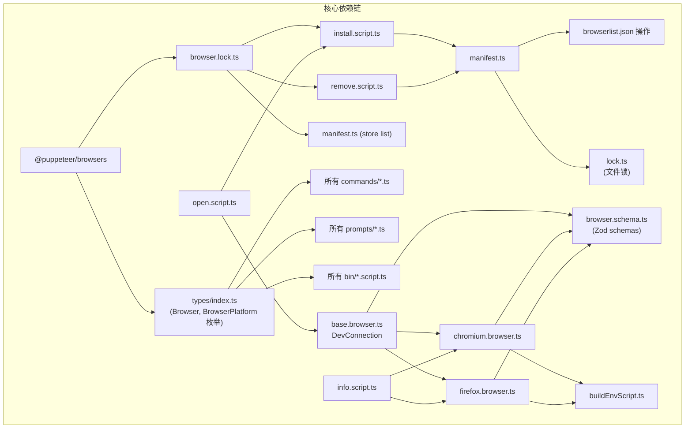

# 项目架构

pbvm 采用 pnpm workspace 单仓架构，包含 CLI 核心包和文档站点两个子项目。

```mermaid
  graph TB
      subgraph "pnpm Workspace"
          CLI["🐚 pbvm-cli<br/>CLI 工具<br/>Node.js ≥22 / ESM"]
          DOCS["📖 documentation<br/>Docusaurus 3.10<br/>React 19 / Tailwind 4"]
      end

      subgraph "CLI 入口层"
          ENTRY["src/index.ts<br/>Commander 启动器"]
      end

      subgraph "命令注册层<br/>src/commands/"
          CMD_CREATE["create"]
          CMD_LIST["list / store"]
          CMD_REMOVE["remove"]
          CMD_ALIAS["alias"]
          CMD_INFO["info"]
          CMD_OPEN["open"]
          CMD_SEARCH["search"]
          CMD_RESTORE["restore"]
          CMD_CLEAR["clear"]
      end

      subgraph "执行脚本层<br/>src/bin/"
          SCRIPT_INSTALL["install.script.ts"]
          SCRIPT_REMOVE["remove.script.ts"]
          SCRIPT_ALIAS["alias.script.ts"]
          SCRIPT_OPEN["open.script.ts"]
          SCRIPT_INFO["info.script.ts"]
          SCRIPT_LIST["list.script.ts"]
          SCRIPT_SEARCH["search.script.ts"]
          SCRIPT_CLEAR["clear.script.ts"]
      end

      subgraph "浏览器抽象层<br/>src/browser/"
          BROWSER_LOCK["browser.lock.ts<br/>安装/卸载/列表<br/>+ 文件锁"]
          BROWSER_BASE["base.browser.ts<br/>DevConnection<br/>WebSocket CDP/BiDi<br/>generateRuntimeInfo"]
          BROWSER_CHROMIUM["chromium.browser.ts<br/>CDP 协议<br/>headless=new/old 降级"]
          BROWSER_FIREFOX["firefox.browser.ts<br/>WebDriver BiDi<br/>RemoteValue 序列化"]
          BROWSER_ENV["buildEnvScript.ts<br/>浏览器指纹采集<br/>注入页面执行"]
      end

      subgraph "工具层<br/>src/utils/"
          UTIL_MANIFEST["manifest.ts<br/>browserlist.json 增删改查<br/>store 列表查询"]
          UTIL_LOCK["lock.ts<br/>进程级文件锁<br/>acquireLock / waitForLock"]
          UTIL_PATHS["paths.ts<br/>env-paths 目录管理<br/>cache/data/config/log/temp"]
          UTIL_LOGGER["logger.ts<br/>chalk + ora<br/>banner / spinner"]
          UTIL_FIELDS["fields.ts<br/>类型守卫 / 安全执行"]
          UTIL_PKG["pkg.ts<br/>package.json 版本读取"]
      end

      subgraph "类型 & Schema 层<br/>src/"
          TYPES["types/index.ts<br/>Zod Schema 定义<br/>TypeScript 类型导出"]
          API["api.ts<br/>公共 API 导出<br/>launchBrowser()"]
      end

      subgraph "交互层<br/>src/prompts/"
          PROMPT_CREATE["create.prompt.ts"]
          PROMPT_ALIAS["alias.prompt.ts"]
          PROMPT_MANIFEST["manifest.prompt.ts"]
          PROMPT_COMMON["common.prompt.ts"]
      end

      subgraph "外部依赖"
          PUPPETEER["@puppeteer/browsers<br/>浏览器安装/检测/平台"]
          COMMANDER["commander<br/>CLI 框架"]
          INQUIRER["@inquirer/prompts<br/>交互式提示"]
          ZOD["zod<br/>运行时校验"]
          CHALK["chalk / ora<br/>终端输出"]
      end

      ENTRY --> CMD_CREATE & CMD_LIST & CMD_REMOVE & CMD_ALIAS & CMD_INFO & CMD_OPEN & CMD_SEARCH & CMD_RESTORE & CMD_CLEAR
      CMD_CREATE --> SCRIPT_INSTALL
      CMD_REMOVE --> SCRIPT_REMOVE
      CMD_ALIAS --> SCRIPT_ALIAS
      CMD_OPEN --> SCRIPT_OPEN
      CMD_INFO --> SCRIPT_INFO
      CMD_LIST --> SCRIPT_LIST
      CMD_SEARCH --> SCRIPT_SEARCH
      CMD_CLEAR --> SCRIPT_CLEAR

      SCRIPT_INSTALL & SCRIPT_REMOVE --> BROWSER_LOCK
      SCRIPT_OPEN --> SCRIPT_INSTALL
      SCRIPT_INFO & SCRIPT_OPEN --> BROWSER_CHROMIUM & BROWSER_FIREFOX
      BROWSER_CHROMIUM & BROWSER_FIREFOX --> BROWSER_BASE
      BROWSER_CHROMIUM & BROWSER_FIREFOX --> BROWSER_ENV
      BROWSER_LOCK --> PUPPETEER

      CMD_CREATE & CMD_ALIAS --> PROMPT_CREATE & PROMPT_ALIAS & PROMPT_MANIFEST
      CMD_REMOVE & CMD_INFO & CMD_OPEN & CMD_CLEAR --> PROMPT_MANIFEST
      PROMPT_COMMON --> INQUIRER

      SCRIPT_INSTALL & SCRIPT_ALIAS & SCRIPT_LIST & SCRIPT_REMOVE --> UTIL_MANIFEST
      UTIL_MANIFEST --> UTIL_LOCK
      BROWSER_LOCK --> UTIL_LOCK
      UTIL_LOCK --> UTIL_PATHS

      TYPES --> ZOD
      CMD_CREATE & CMD_REMOVE & CMD_ALIAS & CMD_INFO & CMD_OPEN --> TYPES
      API --> PUPPETEER
      API --> UTIL_MANIFEST
      API --> SCRIPT_OPEN
```

## 关键模块说明

| 模块                  | 路径           | 职责                                                                                                                                         |
| --------------------- | -------------- | -------------------------------------------------------------------------------------------------------------------------------------------- |
| `browser.lock.ts`     | `src/browser/` | 对 `@puppeteer/browsers` 的 `install` / `uninstall` / `getInstalledBrowsers` 加锁封装，防止并发读写 cache 目录                               |
| `base.browser.ts`     | `src/browser/` | WebSocket 连接抽象（`DevConnection`）、进程启动、endpoint 捕获，Chromium 和 Firefox 共用                                                     |
| `chromium.browser.ts` | `src/browser/` | CDP 协议实现，通过 `Browser.getVersion` / `Target.attachToTarget` / `Runtime.evaluate` 采集运行时信息，支持 `headless=new` 降级到 `headless` |
| `firefox.browser.ts`  | `src/browser/` | WebDriver BiDi 协议实现，通过 `session.new` / `script.evaluate` 采集运行时信息，`RemoteValue` 反序列化                                       |
| `buildEnvScript.ts`   | `src/browser/` | 注入浏览器页面执行的指纹采集脚本，收集 `userAgent`、`webgl`、`screen`、`timezone` 等环境信息                                                 |
| `manifest.ts`         | `src/utils/`   | `browserlist.json` 读写 + Store 列表查询，支持按 alias 或 `browser@buildId` 查找                                                             |
| `lock.ts`             | `src/utils/`   | 进程级文件锁，`acquireLock` 获取写锁（排他），`waitForLock` 等待读锁释放                                                                     |
| `paths.ts`            | `src/utils/`   | 基于 `env-paths` 的目录管理，提供 `cache` / `data` / `config` / `log` / `temp` 五个标准路径                                                  |

## 核心依赖链

## 总结

| 层级      | 职责                                  | 关键文件             |
| --------- | ------------------------------------- | -------------------- |
| 入口      | Commander CLI 启动、命令注册          | src/index.ts         |
| 命令层    | 参数解析、交互式补全、权限确认        | src/commands/\*.ts   |
| Prompt 层 | @inquirer/prompts 交互式问答          | src/prompts/\*.ts    |
| 脚本层    | 核心业务逻辑                          | src/bin/\*.script.ts |
| 浏览器层  | CDP/BiDi WebSocket 通信、进程管理、锁 | src/browser/\*.ts    |
| 工具层    | manifest 管理、文件锁、路径、日志     | src/utils/\*.ts      |
| 类型层    | Zod 运行时校验 + TypeScript 类型      | src/types/index.ts   |
| API       | 对外暴露 launchBrowser()              | src/api.ts           |
| 文档      | Docusaurus 3 + Tailwind 4 + React 19  | documentation/       |
