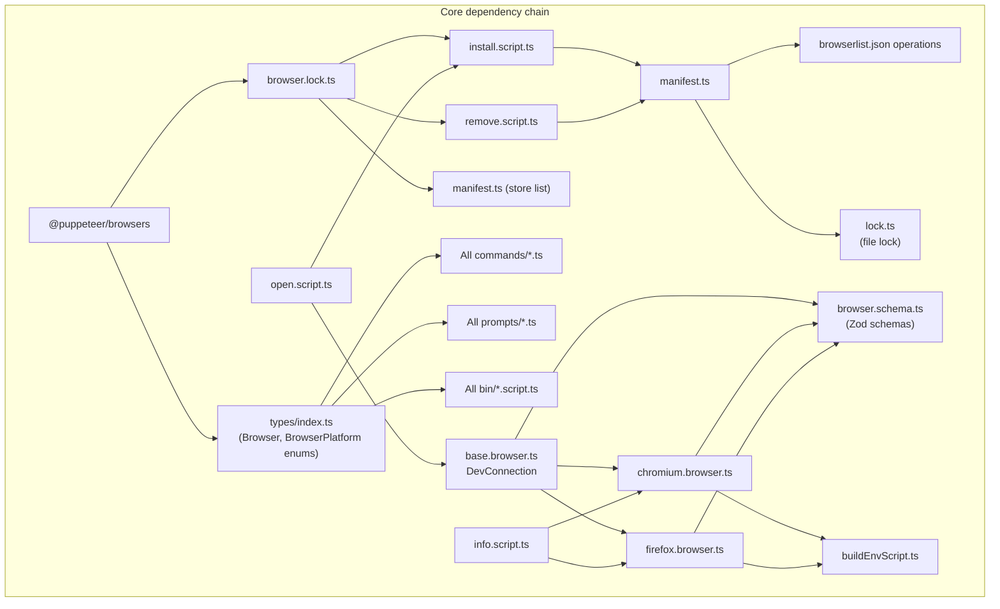

# Project architecture

pbvm uses a pnpm workspace monorepo structure, containing the CLI core package and a documentation site.

```mermaid
  graph TB
      subgraph "pnpm Workspace"
          CLI["🐚 pbvm-cli<br/>CLI tool<br/>Node.js ≥22 / ESM"]
          DOCS["📖 documentation<br/>Docusaurus 3.10<br/>React 19 / Tailwind 4"]
      end

      subgraph "CLI entry layer"
          ENTRY["src/index.ts<br/>Commander launcher"]
      end

      subgraph "Command registration layer<br/>src/commands/"
          CMD_CREATE["create"]
          CMD_LIST["list / store"]
          CMD_REMOVE["remove"]
          CMD_ALIAS["alias"]
          CMD_INFO["info"]
          CMD_OPEN["open"]
          CMD_SEARCH["search"]
          CMD_RESTORE["restore"]
          CMD_CLEAR["clear"]
      end

      subgraph "Execution script layer<br/>src/bin/"
          SCRIPT_INSTALL["install.script.ts"]
          SCRIPT_REMOVE["remove.script.ts"]
          SCRIPT_ALIAS["alias.script.ts"]
          SCRIPT_OPEN["open.script.ts"]
          SCRIPT_INFO["info.script.ts"]
          SCRIPT_LIST["list.script.ts"]
          SCRIPT_SEARCH["search.script.ts"]
          SCRIPT_CLEAR["clear.script.ts"]
      end

      subgraph "Browser abstraction layer<br/>src/browser/"
          BROWSER_LOCK["browser.lock.ts<br/>install/uninstall/list<br/>+ file lock"]
          BROWSER_BASE["base.browser.ts<br/>DevConnection<br/>WebSocket CDP/BiDi<br/>generateRuntimeInfo"]
          BROWSER_CHROMIUM["chromium.browser.ts<br/>CDP protocol<br/>headless=new/old fallback"]
          BROWSER_FIREFOX["firefox.browser.ts<br/>WebDriver BiDi<br/>RemoteValue serialization"]
          BROWSER_ENV["buildEnvScript.ts<br/>Browser fingerprint collection<br/>Injected into page"]
      end

      subgraph "Utility layer<br/>src/utils/"
          UTIL_MANIFEST["manifest.ts<br/>browserlist.json CRUD<br/>store list query"]
          UTIL_LOCK["lock.ts<br/>Process-level file lock<br/>acquireLock / waitForLock"]
          UTIL_PATHS["paths.ts<br/>env-paths directory management<br/>cache/data/config/log/temp"]
          UTIL_LOGGER["logger.ts<br/>chalk + ora<br/>banner / spinner"]
          UTIL_FIELDS["fields.ts<br/>type guards / safe execution"]
          UTIL_PKG["pkg.ts<br/>package.json version read"]
      end

      subgraph "Type & Schema layer<br/>src/"
          TYPES["types/index.ts<br/>Zod Schema definitions<br/>TypeScript type exports"]
          API["api.ts<br/>Public API export<br/>launchBrowser()"]
      end

      subgraph "Interactive layer<br/>src/prompts/"
          PROMPT_CREATE["create.prompt.ts"]
          PROMPT_ALIAS["alias.prompt.ts"]
          PROMPT_MANIFEST["manifest.prompt.ts"]
          PROMPT_COMMON["common.prompt.ts"]
      end

      subgraph "External dependencies"
          PUPPETEER["@puppeteer/browsers<br/>Browser install/detect/platform"]
          COMMANDER["commander<br/>CLI framework"]
          INQUIRER["@inquirer/prompts<br/>Interactive prompts"]
          ZOD["zod<br/>Runtime validation"]
          CHALK["chalk / ora<br/>Terminal output"]
      end

      ENTRY --> CMD_CREATE & CMD_LIST & CMD_REMOVE & CMD_ALIAS & CMD_INFO & CMD_OPEN & CMD_SEARCH & CMD_RESTORE & CMD_CLEAR
      CMD_CREATE --> SCRIPT_INSTALL
      CMD_REMOVE --> SCRIPT_REMOVE
      CMD_ALIAS --> SCRIPT_ALIAS
      CMD_OPEN --> SCRIPT_OPEN
      CMD_INFO --> SCRIPT_INFO
      CMD_LIST --> SCRIPT_LIST
      CMD_SEARCH --> SCRIPT_SEARCH
      CMD_CLEAR --> SCRIPT_CLEAR

      SCRIPT_INSTALL & SCRIPT_REMOVE --> BROWSER_LOCK
      SCRIPT_OPEN --> SCRIPT_INSTALL
      SCRIPT_INFO & SCRIPT_OPEN --> BROWSER_CHROMIUM & BROWSER_FIREFOX
      BROWSER_CHROMIUM & BROWSER_FIREFOX --> BROWSER_BASE
      BROWSER_CHROMIUM & BROWSER_FIREFOX --> BROWSER_ENV
      BROWSER_LOCK --> PUPPETEER

      CMD_CREATE & CMD_ALIAS --> PROMPT_CREATE & PROMPT_ALIAS & PROMPT_MANIFEST
      CMD_REMOVE & CMD_INFO & CMD_OPEN & CMD_CLEAR --> PROMPT_MANIFEST
      PROMPT_COMMON --> INQUIRER

      SCRIPT_INSTALL & SCRIPT_ALIAS & SCRIPT_LIST & SCRIPT_REMOVE --> UTIL_MANIFEST
      UTIL_MANIFEST --> UTIL_LOCK
      BROWSER_LOCK --> UTIL_LOCK
      UTIL_LOCK --> UTIL_PATHS

      TYPES --> ZOD
      CMD_CREATE & CMD_REMOVE & CMD_ALIAS & CMD_INFO & CMD_OPEN --> TYPES
      API --> PUPPETEER
      API --> UTIL_MANIFEST
      API --> SCRIPT_OPEN
```

## Key modules

| Module                | Path           | Responsibility                                                                                                                                    |
| --------------------- | -------------- | ------------------------------------------------------------------------------------------------------------------------------------------------- |
| `browser.lock.ts`     | `src/browser/` | Locked wrapper around `@puppeteer/browsers` `install` / `uninstall` / `getInstalledBrowsers`, preventing concurrent cache directory access       |
| `base.browser.ts`     | `src/browser/` | WebSocket connection abstraction (`DevConnection`), process spawning, endpoint capture — shared by Chromium and Firefox                          |
| `chromium.browser.ts` | `src/browser/` | CDP protocol implementation; collects runtime info via `Browser.getVersion` / `Target.attachToTarget` / `Runtime.evaluate`; supports `headless=new` fallback to `headless` |
| `firefox.browser.ts`  | `src/browser/` | WebDriver BiDi protocol implementation; collects runtime info via `session.new` / `script.evaluate`; `RemoteValue` deserialization               |
| `buildEnvScript.ts`   | `src/browser/` | Fingerprint collection script injected into browser pages; collects `userAgent`, `webgl`, `screen`, `timezone`, etc.                             |
| `manifest.ts`         | `src/utils/`   | `browserlist.json` read/write + Store list query; supports lookup by alias or `browser@buildId`                                                  |
| `lock.ts`             | `src/utils/`   | Process-level file lock; `acquireLock` for exclusive write lock, `waitForLock` for waiting on read lock release                                  |
| `paths.ts`            | `src/utils/`   | Directory management based on `env-paths`; provides five standard paths: `cache` / `data` / `config` / `log` / `temp`                            |

## Core dependency chain

## Summary

| Layer        | Responsibility                             | Key files            |
| ------------ | ------------------------------------------ | -------------------- |
| Entry        | Commander CLI startup, command registration | src/index.ts         |
| Command      | Arg parsing, interactive completion, confirmation | src/commands/\*.ts   |
| Prompt       | @inquirer/prompts interactive Q&A          | src/prompts/\*.ts    |
| Script       | Core business logic                        | src/bin/\*.script.ts |
| Browser      | CDP/BiDi WebSocket communication, process management, locking | src/browser/\*.ts    |
| Utility      | manifest management, file lock, paths, logging | src/utils/\*.ts      |
| Type         | Zod runtime validation + TypeScript types  | src/types/index.ts   |
| API          | Public export: launchBrowser()             | src/api.ts           |
| Docs         | Docusaurus 3 + Tailwind 4 + React 19       | documentation/       |
