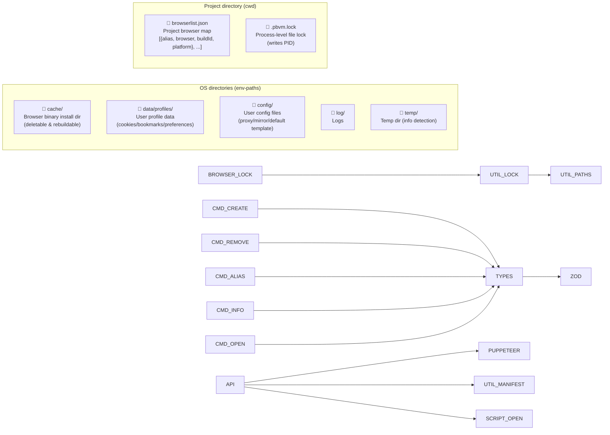
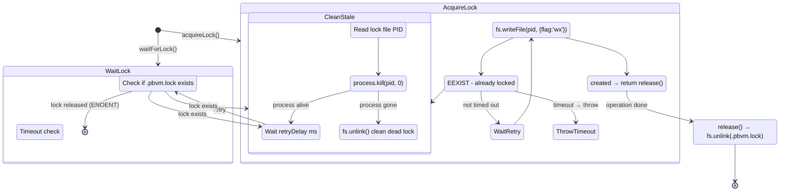

# Store & cache directory

pbvm uses OS-standard directory structures to store browser binaries, user data, and configuration.

## Directory structure

```
{pbvm data root}
├── cache/          ← Browser binaries (can be deleted and re-downloaded)
├── data/           ← User profiles, runtime data (do not delete casually)
│   └── profiles/
│       ├── chrome/
│       │   └── 134.0.6998.35/
│       ├── chromium/
│       │   └── 1435764/
│       └── firefox/
│           └── stable_136.0.0/
├── config/         ← User configuration files
├── log/            ← Logs
└── temp/           ← Temporary files (e.g. `pbvm info -r` temp profile)
```

## Directory descriptions

| Directory       | Purpose                                                 |      Can delete?      |
| --------------- | ------------------------------------------------------- | :-------------------: |
| `cache`         | Browser binaries (downloaded via `@puppeteer/browsers`) | ✅ System cleaners OK |
| `data/profiles` | Browser user data: cookies, preferences, history, etc.  |          ❌           |
| `config`        | User custom config (proxy, mirror, etc.)                | ⚠️ Context-dependent  |
| `log`           | Runtime logs                                            |          ✅           |
| `temp`          | Temporary detection data (`info -r` headless launch)    |          ✅           |

## Actual paths

Varies by OS, resolved via [`env-paths`](https://github.com/sindresorhus/env-paths):

| Platform | Path                                                            |
| -------- | --------------------------------------------------------------- |
| macOS    | `~/Library/Caches/pbvm/`, `~/Library/Application Support/pbvm/` |
| Linux    | `~/.cache/pbvm/`, `~/.local/share/pbvm/`                        |
| Windows  | `%LOCALAPPDATA%/pbvm/`                                          |

## Store vs browserlist relationship

```
┌──────────────────────────────────────────────────┐
│                   Global Store                     │
│  chrome/mac_arm-134.0.6998.35/                   │
│  chromium/mac_arm-1435764/                        │
│  firefox/mac_arm-stable_136.0.0/                  │
└──────────────┬───────────────────────────────────┘
               │ referenced on demand
               ▼
┌──────────────────────────────────────────────────┐
│  Project A/browserlist.json                       │
│  [{ chrome@134.0.6998.35, alias: "prod" }]       │
└──────────────────────────────────────────────────┘
┌──────────────────────────────────────────────────┐
│  Project B/browserlist.json                       │
│  [{ chrome@134.0.6998.35, alias: "test" }]       │
│  [{ firefox@stable_136.0.0 }]                     │
└──────────────────────────────────────────────────┘
```

The same binary can be referenced by multiple projects, each with its own independent profile data.

## Data storage & file structure



## File lock mechanism


