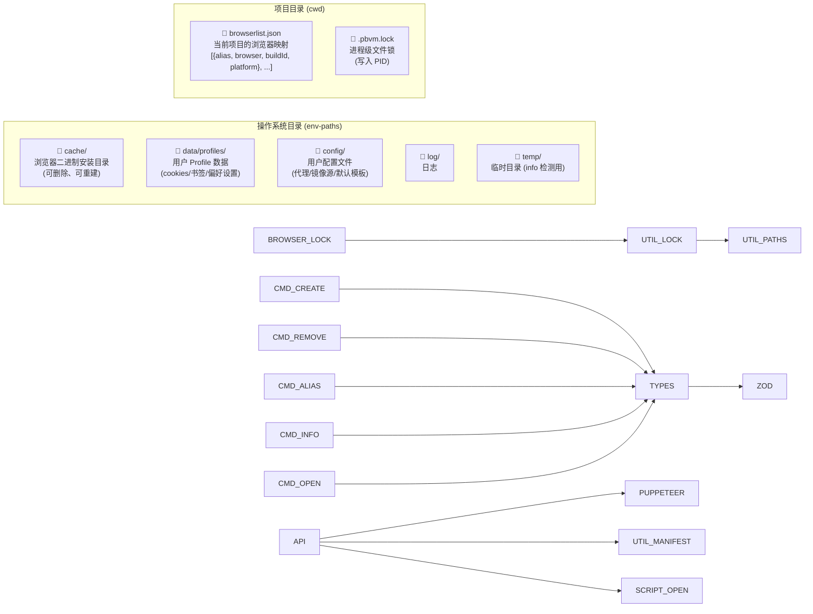
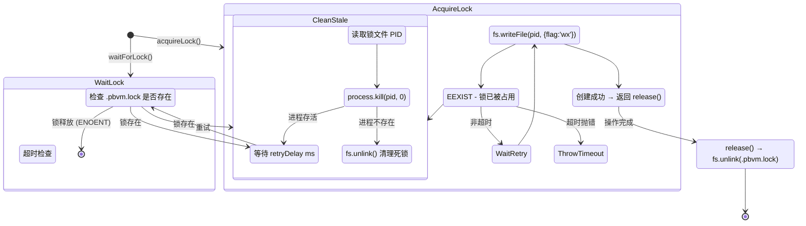

# Store 与缓存目录

pbvm 使用符合系统标准的目录结构存储浏览器二进制文件、用户数据和配置。

## 目录结构

```
{pbvm 数据根目录}
├── cache/          ← 浏览器二进制文件（可删除、可重新下载）
├── data/           ← 用户 profile、运行数据（不能随意删除）
│   └── profiles/
│       ├── chrome/
│       │   └── 134.0.6998.35/
│       ├── chromium/
│       │   └── 1435764/
│       └── firefox/
│           └── stable_136.0.0/
├── config/         ← 用户配置文件
├── log/            ← 日志
└── temp/           ← 临时文件（如 `pbvm info -r` 的临时 profile）
```

## 各目录说明

| 目录            | 用途                                                |       可否删除        |
| --------------- | --------------------------------------------------- | :-------------------: |
| `cache`         | 浏览器二进制文件（通过 `@puppeteer/browsers` 下载） | ✅ 系统清理工具可清空 |
| `data/profiles` | 浏览器用户数据：cookies、偏好设置、历史记录等       |          ❌           |
| `config`        | 用户自定义配置（代理、镜像源等）                    |     ⚠️ 视内容而定     |
| `log`           | 运行时日志                                          |          ✅           |
| `temp`          | 临时检测数据（`info -r` 的 headless 启动）          |          ✅           |

## 实际路径

因操作系统而异，由 [`env-paths`](https://github.com/sindresorhus/env-paths) 解析：

| 平台    | 路径                                                            |
| ------- | --------------------------------------------------------------- |
| macOS   | `~/Library/Caches/pbvm/`、`~/Library/Application Support/pbvm/` |
| Linux   | `~/.cache/pbvm/`、`~/.local/share/pbvm/`                        |
| Windows | `%LOCALAPPDATA%/pbvm/`                                          |

## Store 与 browserlist 的关系

```
┌──────────────────────────────────────────────────┐
│                   全局 Store                       │
│  chrome/mac_arm-134.0.6998.35/                   │
│  chromium/mac_arm-1435764/                        │
│  firefox/mac_arm-stable_136.0.0/                  │
└──────────────┬───────────────────────────────────┘
               │ 按需引用
               ▼
┌──────────────────────────────────────────────────┐
│  项目 A/browserlist.json                          │
│  [{ chrome@134.0.6998.35, alias: "prod" }]       │
└──────────────────────────────────────────────────┘
┌──────────────────────────────────────────────────┐
│  项目 B/browserlist.json                          │
│  [{ chrome@134.0.6998.35, alias: "test" }]       │
│  [{ firefox@stable_136.0.0 }]                     │
└──────────────────────────────────────────────────┘
```

同一个二进制文件可被多个项目引用，每个项目的 profile 数据独立。

## 数据存储 & 文件结构



## 文件锁机制


