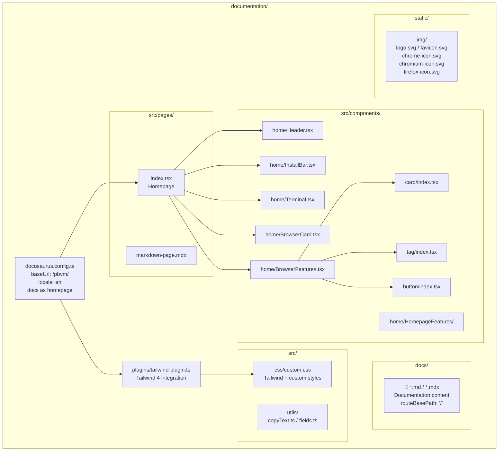

# pbvm

**pbvm** (Puppeteer Browser Version Manager) is a browser version management tool based on `@puppeteer/browsers`. It helps you install, manage, and run multiple versions of Chrome, Chromium, and Firefox across different projects.

## Quick start

### Installation

```bash
npm install -g pbvm-cli
```

Requirements: **Node.js >= 22**, **pnpm >= 9**.

### Install your first browser

```bash
pbvm create -b chrome -i 134.0.6998.35 -a my-chrome
```

This downloads Chrome 134.0.6998.35 to the global cache directory and records it in the current directory's `browserlist.json`.

### Open a browser

```bash
pbvm open -t my-chrome
pbvm open -t chrome@134.0.6998.35 -u https://example.com
```

### See all commands

```bash
pbvm -h
```

## How it works

```
┌─────────────┐     ┌──────────────────┐     ┌─────────────────┐
│  pbvm CLI   │────▶│  Global Store     │────▶│ browserlist.json │
│  Commands   │     │  (browser binaries)│     │ (project manifest)│
└─────────────┘     └──────────────────┘     └─────────────────┘
```

- **Global Store**: browser binaries are cached in standard system data directories and can be shared across multiple projects
- **browserlist.json**: a manifest file in each project root that records which browsers and aliases the project uses
- **Profile**: each browser instance has its own user data directory (cookies, preferences, history, etc.), independent of the binaries

## Design constraints

To ensure stability, pbvm is designed for **development environment** use only:

- **Auto-update disabled**: Firefox uses both `policies.json` and `user.js` to block updates; Chromium/Chrome disables updates and first-run wizards via launch flags
- **Default browser check disabled**: avoids popups that interfere with automation
- **No launch path lock-in**: you can open a browser from any directory by alias or `browser@buildId` — no binding to a project directory

## Supported browsers

| Browser  | buildId format                | Example          |
| -------- | ----------------------------- | ---------------- |
| chrome   | `x.x.x.x` (4-part version)    | `134.0.6998.35`  |
| chromium | Numeric revision number       | `1435764`        |
| firefox  | `channel_version`             | `stable_136.0.0` |

## Documentation site architecture


