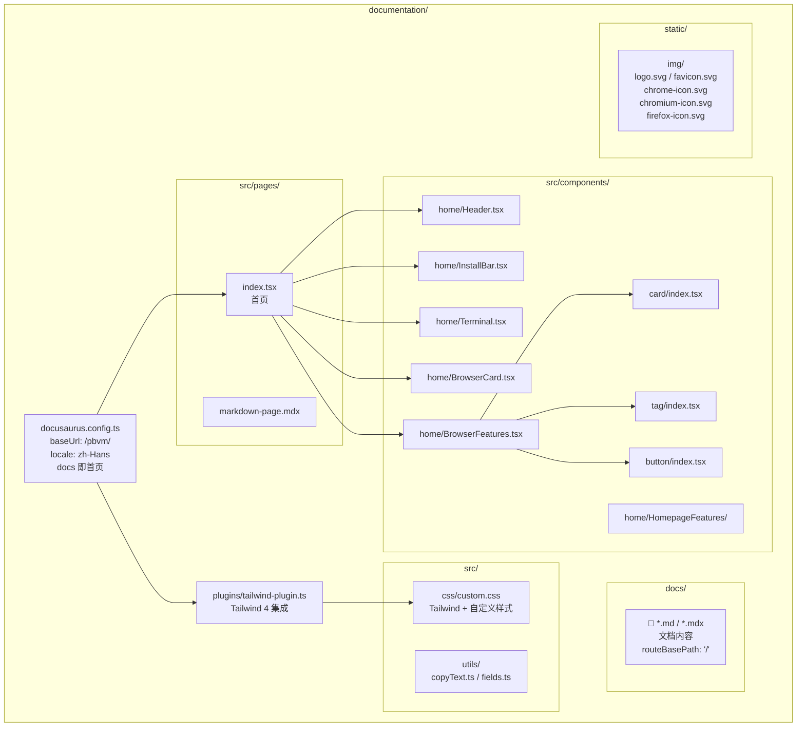

# pbvm

**pbvm**（Puppeteer Browser Version Manager）是基于 `@puppeteer/browsers` 的浏览器版本管理工具，帮助你在不同项目中安装、管理和运行多个版本的 Chrome、Chromium、Firefox。

## 快速开始

### 安装

```bash
npm install -g pbvm-cli
```

环境要求：**Node.js >= 22**，**pnpm >= 9**。

### 安装第一个浏览器

```bash
pbvm create -b chrome -i 134.0.6998.35 -a my-chrome
```

这会将 Chrome 134.0.6998.35 下载到全局缓存目录，并在当前目录的 `browserlist.json` 中记录此浏览器。

### 打开浏览器

```bash
pbvm open -t my-chrome
pbvm open -t chrome@134.0.6998.35 -u https://example.com
```

### 查看所有命令

```bash
pbvm -h
```

## 工作原理

```
┌─────────────┐     ┌──────────────────┐     ┌─────────────────┐
│  pbvm CLI   │────▶│  全局 Store 缓存   │────▶│  browserlist.json │
│  命令交互    │     │  (浏览器二进制文件)  │     │  (项目浏览器清单)   │
└─────────────┘     └──────────────────┘     └─────────────────┘
```

- **全局 Store**：浏览器二进制文件缓存在系统标准数据目录中，多个项目可共享
- **browserlist.json**：每个项目根目录下的清单文件，记录该项目使用的浏览器及其别名
- **Profile**：每个浏览器实例的用户数据目录（cookies、偏好设置、历史记录等），独立于二进制文件

## 设计约束

为保障稳定性，pbvm 仅支持**开发环境**使用：

- **禁止自动更新**：Firefox 通过 `policies.json` 和 `user.js` 双保险禁用更新；Chromium/Chrome 通过启动参数禁用更新和首次运行向导
- **禁用默认浏览器检查**：避免弹窗干扰自动化流程
- **不锁启动路径**：你可以在任意目录通过别名或 `browser@buildId` 打开浏览器，不绑定项目目录

## 支持浏览器

| 浏览器   | buildId 格式            | 示例             |
| -------- | ----------------------- | ---------------- |
| chrome   | `x.x.x.x`（四段版本号） | `134.0.6998.35`  |
| chromium | revision 号（纯数字）   | `1435764`        |
| firefox  | `channel_version`       | `stable_136.0.0` |

## 文档站点架构


