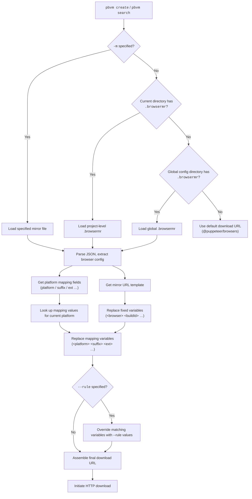

# Resources & mirrors

Online references for obtaining browser version numbers and available mirror sources.

## Getting version numbers

The `buildId` required by `create` and `search` varies by browser. Below are the most authoritative lookup sources.

### Chrome

| Resource                                                                                                                                  | Description                                                                                  |
| ----------------------------------------------------------------------------------------------------------------------------------------- | -------------------------------------------------------------------------------------------- |
| [Chrome for Testing - Known Good Versions](https://googlechromelabs.github.io/chrome-for-testing/known-good-versions-with-downloads.json) | Official JSON of available Chrome versions from Google, including per-platform download URLs |
| [Puppeteer Supported Browsers](https://pptr.dev/supported-browsers)                                                                       | Puppeteer's officially maintained browser support list, mapping Chrome versions to `buildId` |

`buildId` format: 4-part version number, e.g. `134.0.6998.35`.

```bash
# Get buildId from JSON and install directly
pbvm create -b chrome -i 134.0.6998.35

# Search first to confirm the remote version exists
pbvm search -b chrome -i 134.0.6998.35
```

### Chromium

| Resource                                                                                                  | Description                                                                           |
| --------------------------------------------------------------------------------------------------------- | ------------------------------------------------------------------------------------- |
| [Chromium Dash](https://chromiumdash.appspot.com/home)                                                    | Chromium release dashboard; query revision numbers and build progress by platform     |
| [Chromium Snapshot Index](https://commondatastorage.googleapis.com/chromium-browser-snapshots/index.html) | Chromium snapshot storage bucket root; browse files directly by platform and revision |

`buildId` format: numeric revision number, e.g. `1435764`.

```bash
pbvm create -b chromium -i 1435764
```

### Firefox

| Resource                                                              | Description                                                                                 |
| --------------------------------------------------------------------- | ------------------------------------------------------------------------------------------- |
| [Mozilla Archive (Firefox)](https://archive.mozilla.org/pub/firefox/) | Mozilla's official FTP archive, organized by channel (release / beta / nightly) and version |

`buildId` format: `channel_version`, e.g. `stable_136.0.0`. Note the underscore separating the channel prefix and version number.

```bash
pbvm create -b firefox -i stable_136.0.0
```

## Mirror resources

In mainland China, using the npmmirror mirror can significantly improve download speed. Below are the npmmirror browse URLs for each browser and the corresponding pbvm mirror configuration.

| Browser  | npmmirror browse URL                                                                                      |
| -------- | --------------------------------------------------------------------------------------------------------- |
| Chrome   | [chrome-for-testing](https://registry.npmmirror.com/binary.html?path=chrome-for-testing/)                 |
| Chromium | [chromium-browser-snapshots](https://registry.npmmirror.com/binary.html?path=chromium-browser-snapshots/) |
| Firefox  | [firefox](https://registry.npmmirror.com/binary.html?path=firefox/)                                       |

### Enabling a mirror

```bash
# Enable npmmirror globally
pbvm mirror -s npmmirror

# Enable for the current project only
pbvm mirror -s npmmirror -i
```

Once enabled, all `create` and `search` commands automatically use the mirror for downloads. The actual mirror rule file is located at `public/mirror/npmmirror.json`, which defines the URL templates and platform mappings for each browser.

### One-off use

Even without a global mirror, you can specify one on a per-command basis:

```bash
pbvm create -b chrome -i 134.0.6998.35 -m ./path/to/.browsermr
pbvm search -b firefox -i stable_136.0.0 -m ./path/to/.browsermr
```

For more mirror configuration details, see the [mirror command docs](./commands/mirror.mdx).

## Puppeteer browser support overview

Each Puppeteer version is associated with specific Chrome and Firefox versions. [pptr.dev/supported-browsers](https://pptr.dev/supported-browsers) is the most direct reference. If you're unsure which version to install:

1. Visit [Puppeteer Supported Browsers](https://pptr.dev/supported-browsers) to find the browser `buildId` for your target Puppeteer version
2. Run `pbvm search -b <browser> -i <buildId>` to confirm the remote is available
3. Run `pbvm create -b <browser> -i <buildId>` to install

## Custom mirrors

### Getting a template file

```bash
# Generate a .browsermr template in the current directory
pbvm mirror -i
# Follow the interactive prompts to choose a mirror source (e.g. npmmirror)
```

You can also reference the built-in template directly: [npmmirror.json](https://github.com/cgfeel/pbvm/blob/main/public/mirror/npmmirror.json).

### File structure

`.browsermr` is a JSON file. The top-level keys are browser names (matching the `Browser` enum from `@puppeteer/browsers`). Each browser entry must contain a `mirror` field; the remaining fields are platform mappings defined on demand.

```json
{
  "chrome": {
    "mirror": "<mirror URL template>",
    "<mapping field>": { "linux": "...", "mac": "...", "mac_arm": "..." }
  }
}
```

### URL template variables

Placeholders enclosed in `<>` in the mirror URL are replaced with actual values at download time:

| Variable      | Source        | Description                                                                            |
| ------------- | ------------- | -------------------------------------------------------------------------------------- |
| `<browser>`   | Fixed         | Browser name: `chrome`, `chromium`, `firefox`                                          |
| `<platform>`  | Fixed         | Current platform identifier, provided by `@puppeteer/browsers`                         |
| `<buildId>`   | Fixed         | Version number with the channel prefix stripped (Firefox `stable_136.0.0` → `136.0.0`) |
| `<channelId>` | Fixed         | Full channel + version, Firefox only                                                   |
| `<lang>`      | Fixed         | Language, Firefox only, default `zh-CN`                                                |
| `<ext>`       | Mapping field | File extension, resolved by platform from the `ext` mapping                            |
| `<suffix>`    | Mapping field | Browser-specific filename suffix, resolved by platform from the `suffix` mapping       |

**Mapping fields** are the top-level keys alongside `mirror` in the JSON. The key name acts as a template variable name, and its value is a `{ platform: value }` map. For example:

```json
"platform": {
  "linux": "linux64",
  "mac": "mac-x64",
  "mac_arm": "mac-arm64",
  "win32": "win32",
  "win64": "win64"
}
```

In this case `<platform>` is replaced by `mac-arm64` on macOS ARM. `null` means the platform is not supported.

### Substitution example

Using npmmirror's Chromium config, downloading revision `1435764` on macOS (arm64):

- Template: `https://.../<platform>/<buildId>/chrome-<suffix>.zip`
- `platform` mapping for `mac_arm` → `Mac_Arm`
- `suffix` mapping for `mac_arm` → `mac`
- `buildId` fixed → `1435764`

Resulting URL:

```
https://registry.npmmirror.com/-/binary/chromium-browser-snapshots/Mac_Arm/1435764/chrome-mac.zip
```

### Runtime overrides: `--rule`

The `create` and `search` commands accept a `-r/--rule` flag to pass key-value pairs in URL query-string format, overriding identically-named variables in the template:

```bash
# Force lang and ext, ignoring mapped values in .browsermr
pbvm create -b firefox -i stable_136.0.0 -r "lang=en-US&ext=tar.bz2"
```

### Loading priority

1. Mirror file path specified via `-m`
2. `.browsermr` in the current directory
3. `.browsermr` in the pbvm global config directory
4. If none of the above exist: fall back to `@puppeteer/browsers` default download URL

### Overall flow


