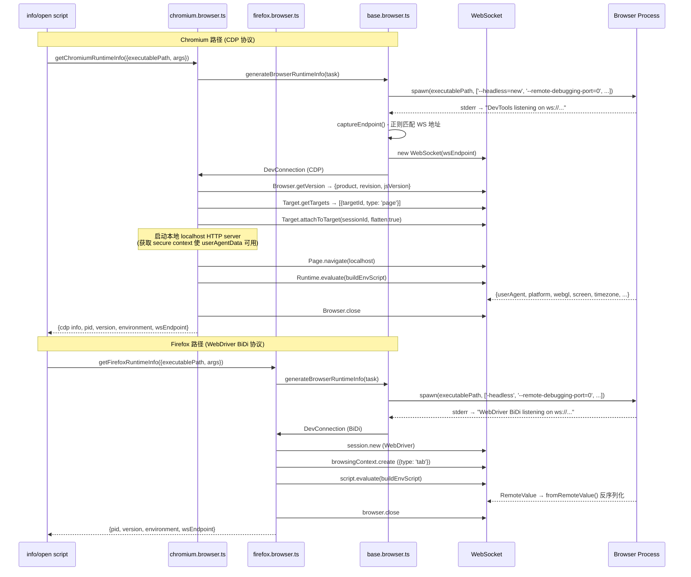

# info

查看浏览器本地存储信息和运行时信息。

## 用法

```bash
pbvm info [-t <target>] [-r]
```

## 选项

| 选项        | 简写 | 说明                                         |
| ----------- | ---- | -------------------------------------------- |
| `--target`  | `-t` | 浏览器标识，格式：`{browser}@{buildId}`      |
| `--runtime` | `-r` | 同时获取运行时信息（需启动 headless 浏览器） |

## 静态信息

始终显示的信息包括：

| 字段             | 说明                                      |
| ---------------- | ----------------------------------------- |
| `platform`       | 浏览器对应平台                            |
| `browser`        | 浏览器名称（chrome / chromium / firefox） |
| `buildId`        | 浏览器版本号                              |
| `executablePath` | 可执行文件路径                            |
| `profilePath`    | 用户数据（profile）目录路径               |
| `exists`         | 可执行文件是否存在                        |
| `size`           | 文件大小                                  |
| `createdAt`      | 安装时间                                  |

## 运行时信息

当使用 `-r` 参数时，会启动 headless 浏览器获取运行时信息：

- **Chrome / Chromium**：User-Agent、WebDriver 端点、DevTools 前端地址等
- **Firefox**：User-Agent、WebDriver 端点、Gecko 版本等

运行时信息以 JSON 格式输出。

## 示例

```bash
# 查看静态信息
pbvm info -t chrome@134.0.6998.35

# 查看静态 + 运行时信息
pbvm info -t chrome@134.0.6998.35 -r

# 交互选择
pbvm info
```

## 输出示例

```
Static info:

  platform: mac_arm
  browser: chrome
  buildId: 134.0.6998.35
  executablePath: /Users/xxx/.cache/pbvm/chrome/mac_arm-134.0.6998.35/...
  profilePath: /Users/xxx/.local/share/pbvm/profiles/chrome/134.0.6998.35
  exists: true
  size: 345.2 MB
  createdAt: 2025-12-01T10:30:00.000Z

Runtime info:
The following information comes from a headless browser

{
  "userAgent": "Mozilla/5.0 ...",
  "webSocketDebuggerUrl": "ws://127.0.0.1:xxx/..."
}
```

## 运行时信息采集流

Chromium CDP / Firefox BiDi


