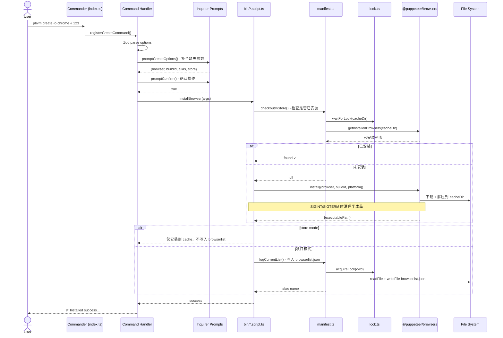

# CLI 命令执行流程

pbvm 所有命令遵循统一的三层处理模式：**参数校验 → 交互补全 → 脚本执行**。

## 请求生命周期

图中以 `create` 命令为例，其余命令流程一致，仅脚本层实现不同。

## 命令层（`src/commands/`）

每个命令文件通过 `registerXxxCommand(program)` 注册到 Commander 实例，负责：

1. 定义命令名、描述、选项参数
2. 调用 `Zod Schema` 做第一层解析（类型校验 + 部分字段填充默认值）
3. 调用对应的 `prompt` 函数补全用户未提供的参数（交互模式）
4. 部分命令（`create`、`remove`、`clear`）在 action 中调用 `promptConfirm` 做二次确认
5. 将完整参数传递给 `bin/*.script.ts` 执行

命令与 Schema 的对应关系：

| 命令             | Schema                | 特殊参数                  |
| ---------------- | --------------------- | ------------------------- |
| `create`         | `createBrowserSchema` | `mirror`、`rule`、`store` |
| `search`         | `createBrowserSchema` | `mirror`、`rule`          |
| `list` / `store` | `browserItemSchema`   | `all`                     |
| `remove`         | `removeBrowserSchema` | `focus`、`store`          |
| `info`           | `infoBrowserSchema`   | `runtime`                 |
| `open`           | `openBrowserSchema`   | `url`                     |
| `alias`          | `aliasBrowserSchema`  | —                         |
| `mirror`         | `mirrorSchema`        | `init`、`source`          |

## Prompt 层（`src/prompts/`）

当用户未提供必选参数时，Prompt 层通过 `@inquirer/prompts` 发起交互式问答。各文件分工：

| 文件                 | 服务于                            | 交互内容                                    |
| -------------------- | --------------------------------- | ------------------------------------------- |
| `create.prompt.ts`   | `create`、`search`                | 浏览器选型、buildId 输入、alias 输入        |
| `mirror.prompt.ts`   | `mirror`                          | 镜像源选择（npmmirror / 关闭）              |
| `alias.prompt.ts`    | `alias`                           | 别名操作类型（设置 / 移除）、目标浏览器选择 |
| `manifest.prompt.ts` | `remove`、`info`、`open`、`clear` | 从 browserlist 或 Store 中选择目标浏览器    |
| `common.prompt.ts`   | `create`、`remove`、`clear`       | 操作确认（confirm）                         |

## 脚本层（`src/bin/`）

脚本层承载核心业务逻辑，不感知 CLI 参数格式和交互细节。每个脚本接收已校验完整的参数对象，执行后返回结果或直接输出日志。

| 脚本                | 职责                                            |
| ------------------- | ----------------------------------------------- |
| `install.script.ts` | 下载 + 解压 + 写入 browserlist                  |
| `remove.script.ts`  | 卸载 + 清理 browserlist + 可选清理 profile      |
| `alias.script.ts`   | 设置 / 移除 browserlist 中的别名                |
| `open.script.ts`    | 定位浏览器 → 必要时触发安装 → spawn 启动        |
| `info.script.ts`    | 读取安装信息 + 可选启动 headless 采集运行时信息 |
| `list.script.ts`    | 格式化输出 Store / 项目浏览器列表               |
| `search.script.ts`  | HTTP HEAD 请求检测远程资源是否存在              |
| `clear.script.ts`   | 清理 Store 中未被任何项目引用的孤立版本         |
| `mirror.script.ts`  | 写入 / 删除 `.browsermr` 配置文件               |

## 并发控制

`manifest.ts` 和 `browser.lock.ts` 的写操作均通过 `lock.ts` 获取文件锁：

- **Cache 目录写锁**：下载、卸载时 `acquireLock(cacheDir)`，防止多进程并发操作同一文件
- **browserlist.json 写锁**：写入项目清单时 `acquireLock(cwd)`，防止并发修改导致数据丢失
- **读操作**：使用 `waitForLock()` 等待写锁释放后再读取，保证读到完整数据

所有锁默认超时 1 分钟，不会永久阻塞。
