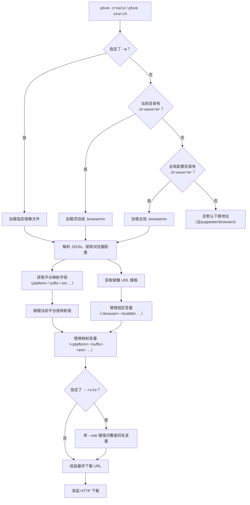

# 资源和镜像

获取各浏览器版本号及可用镜像源的在线参考。

## 获取版本号

`create` 和 `search` 命令需要的 `buildId` 因浏览器而异，以下是最权威的查询入口。

### Chrome

| 资源                                                                                                                                      | 说明                                                               |
| ----------------------------------------------------------------------------------------------------------------------------------------- | ------------------------------------------------------------------ |
| [Chrome for Testing - Known Good Versions](https://googlechromelabs.github.io/chrome-for-testing/known-good-versions-with-downloads.json) | Google 官方提供的可用版本 JSON，包含各平台下载地址                 |
| [Puppeteer Supported Browsers](https://pptr.dev/supported-browsers)                                                                       | Puppeteer 官方维护的浏览器支持列表，列出了 Chrome 对应的 `buildId` |

`buildId` 格式：四段版本号，如 `134.0.6998.35`。

```bash
# 从 JSON 中直接获取 buildId 后安装
pbvm create -b chrome -i 134.0.6998.35

# 先搜索确认远程是否存在
pbvm search -b chrome -i 134.0.6998.35
```

### Chromium

| 资源                                                                                                      | 说明                                                        |
| --------------------------------------------------------------------------------------------------------- | ----------------------------------------------------------- |
| [Chromium Dash](https://chromiumdash.appspot.com/home)                                                    | Chromium 版本发布面板，可查询各平台的 revision 号和构建进度 |
| [Chromium Snapshot Index](https://commondatastorage.googleapis.com/chromium-browser-snapshots/index.html) | Chromium 快照存储桶根目录，按平台和 revision 号直接浏览文件 |

`buildId` 格式：纯数字 revision 号，如 `1435764`。

```bash
pbvm create -b chromium -i 1435764
```

### Firefox

| 资源                                                                  | 说明                                                                      |
| --------------------------------------------------------------------- | ------------------------------------------------------------------------- |
| [Mozilla Archive (Firefox)](https://archive.mozilla.org/pub/firefox/) | Mozilla 官方 FTP 归档，按 channel（release / beta / nightly）和版本号组织 |

`buildId` 格式：`channel_version`，如 `stable_136.0.0`。注意前缀和版本号之间用下划线分隔。

```bash
pbvm create -b firefox -i stable_136.0.0
```

## 镜像资源

国内网络环境下，通过 npmmirror 镜像可显著提升下载速度。以下列出各浏览器的 npmmirror 浏览入口和对应的 pbvm 镜像配置。

| 浏览器   | npmmirror 浏览入口                                                                                        |
| -------- | --------------------------------------------------------------------------------------------------------- |
| Chrome   | [chrome-for-testing](https://registry.npmmirror.com/binary.html?path=chrome-for-testing/)                 |
| Chromium | [chromium-browser-snapshots](https://registry.npmmirror.com/binary.html?path=chromium-browser-snapshots/) |
| Firefox  | [firefox](https://registry.npmmirror.com/binary.html?path=firefox/)                                       |

### 启用镜像

```bash
# 全局启用 npmmirror 镜像
pbvm mirror -s npmmirror

# 仅当前项目启用
pbvm mirror -s npmmirror -i
```

启用后，所有 `create` 和 `search` 命令会自动通过镜像下载。实际使用的镜像规则文件位于 `public/mirror/npmmirror.json`，定义了各浏览器的 URL 模板和平台映射。

### 临时使用

不设置全局镜像时，也可以单次指定：

```bash
pbvm create -b chrome -i 134.0.6998.35 -m ./path/to/.browsermr
pbvm search -b firefox -i stable_136.0.0 -m ./path/to/.browsermr
```

更多镜像配置细节参见 [mirror 命令文档](./commands/mirror.mdx)。

## Puppeteer 浏览器支持总览

Puppeteer 对每个版本都关联了特定版本的 Chrome 和 Firefox，[pptr.dev/supported-browsers](https://pptr.dev/supported-browsers) 是最直接的对照表。如果你不确定该装哪个版本，按以下流程操作：

1. 访问 [Puppeteer Supported Browsers](https://pptr.dev/supported-browsers) 找到目标 Puppeteer 版本对应的浏览器 `buildId`
2. 用 `pbvm search -b <browser> -i <buildId>` 确认远程可用
3. 用 `pbvm create -b <browser> -i <buildId>` 安装

## 自定义镜像

### 获取模板文件

```bash
# 在当前目录生成一份 .browsermr 模板
pbvm mirror -i
# 交互界面选择镜像源（如 npmmirror）
```

也可以直接参考内置模板：[npmmirror.json](https://github.com/cgfeel/pbvm/blob/main/public/mirror/npmmirror.json)。

### 文件结构

`.browsermr` 是一个 JSON 文件，顶层 key 为浏览器名称（与 `@puppeteer/browsers` 的 `Browser` 枚举一致），每个浏览器下必须包含 `mirror` 字段，其余字段为平台映射，按需定义。

```json
{
  "chrome": {
    "mirror": "<镜像 URL 模板>",
    "<映射字段>": { "linux": "...", "mac": "...", "mac_arm": "..." }
  }
}
```

### URL 模板变量

镜像 URL 中用 `<>` 包裹的占位符会在下载时被替换为实际值：

| 变量          | 来源     | 说明                                                                 |
| ------------- | -------- | -------------------------------------------------------------------- |
| `<browser>`   | 固定值   | 浏览器名称，如 `chrome`、`chromium`、`firefox`                       |
| `<platform>`  | 固定值   | 当前平台标识，由 `@puppeteer/browsers` 提供                          |
| `<buildId>`   | 固定值   | 去除 channel 前缀的版本号（Firefox 的 `stable_136.0.0` → `136.0.0`） |
| `<channelId>` | 固定值   | 完整 channel + 版本号，Firefox 专用                                  |
| `<lang>`      | 固定值   | 语言，Firefox 专用，默认 `zh-CN`                                     |
| `<ext>`       | 映射字段 | 文件扩展名，从 `ext` 映射按平台取值                                  |
| `<suffix>`    | 映射字段 | 浏览器专属文件名后缀，从 `suffix` 映射按平台取值                     |

**映射字段**是指在 JSON 中与 `mirror` 同级的对象，key 会作为模板变量名，value 是一个 `{ 平台: 取值 }` 的映射表。例如：

```json
"platform": {
  "linux": "linux64",
  "mac": "mac-x64",
  "mac_arm": "mac-arm64",
  "win32": "win32",
  "win64": "win64"
}
```

此时 `<platform>` 在 macOS ARM 上会被替换为 `mac-arm64`。`null` 表示该平台不支持。

### 替换示例

以 npmmirror 的 Chromium 配置为例，在 macOS (arm64) 下载 revision `1435764`：

- 模板：`https://.../<platform>/<buildId>/chrome-<suffix>.zip`
- `platform` 映射取 `mac_arm` → `Mac_Arm`
- `suffix` 映射取 `mac_arm` → `mac`
- `buildId` 固定值 → `1435764`

最终 URL：

```
https://registry.npmmirror.com/-/binary/chromium-browser-snapshots/Mac_Arm/1435764/chrome-mac.zip
```

### 运行时覆盖：`--rule`

`create` 和 `search` 命令支持 `-r/--rule` 参数，以 URL query-string 格式传入键值对，覆盖模板中的同名变量：

```bash
# 强制指定 lang 和 ext，忽略 .browsermr 中的映射值
pbvm create -b firefox -i stable_136.0.0 -r "lang=en-US&ext=tar.bz2"
```

### 加载优先级

1. `-m` 指定的镜像文件路径
2. 当前目录下的 `.browsermr`
3. pbvm 全局配置目录下的 `.browsermr`
4. 以上都不存在则走 `@puppeteer/browsers` 默认下载地址

### 整体流程


