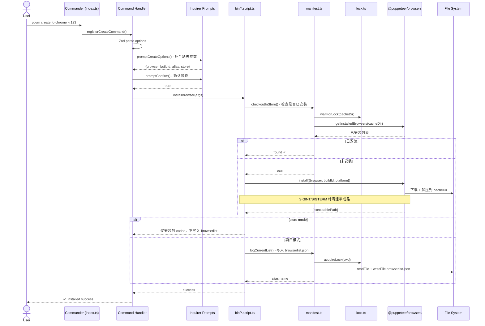

# pbvm


基于 `@puppeteer/browsers` 的浏览器版本管理器，统一管理 Chrome、Chromium、Firefox 的多个版本。

[](https://www.npmjs.com/package/pbvm-cli)
[](LICENSE)
[](https://github.com/cgfeel/pbvm/actions/workflows/pr-check.yml)

📖 [在线文档](https://cgfeel.github.io/pbvm/) | [English](./README.md)

## 特性

- **多浏览器支持** — Chrome、Chromium、Firefox 一键下载与切换
- **版本别名** — 给任意版本起语义化别名（如 `mobile-test`、`bug-repro`），告别 BuildId 记忆
- **跨平台** — macOS、Linux、Windows 统一命令接口
- **交互式操作** — 参数不完整时自动唤起交互提示，无需死记命令格式
- **Monorepo 友好** — 项目级 `browserlist.json` 清单，团队成员共享同一套浏览器配置
- **本地缓存** — 已下载的浏览器缓存到 store 目录，不同项目秒装复用
- **编程 API** — 同时提供 CLI 和 `launchBrowser()` 编程接口，可集成到自动化脚本

## 快速开始

**环境要求：** Node.js ≥ 22

```bash
# 全局安装
npm install -g pbvm-cli

# 下载第一个浏览器
pbvm create

# 查看已安装
pbvm ls
```

## 命令

| 命令           | 说明                                     |
| -------------- | ---------------------------------------- |
| `pbvm create`  | 下载并安装浏览器                         |
| `pbvm ls`      | 列出当前项目已安装的浏览器               |
| `pbvm store`   | 查看本地缓存的浏览器                     |
| `pbvm open`    | 打开指定浏览器                           |
| `pbvm info`    | 查看浏览器详细信息                       |
| `pbvm alias`   | 设置/修改浏览器别名                      |
| `pbvm search`  | 查询远程是否有可用版本                   |
| `pbvm remove`  | 删除浏览器                               |
| `pbvm clear`   | 清除浏览器用户数据（Cookie、历史记录等） |
| `pbvm restore` | 重新安装浏览器                           |

所有命令在缺少参数时会进入交互式选择，无需记忆命令行选项。

## 资源和镜像

`create` / `search` 需要提供 `buildId`，不同浏览器可通过以下入口查询：

| 浏览器   | buildId 格式      | 示例             | 查询入口                                                                                                                                                                      |
| -------- | ----------------- | ---------------- | ----------------------------------------------------------------------------------------------------------------------------------------------------------------------------- |
| Chrome   | 四段版本号        | `134.0.6998.35`  | [Chrome for Testing](https://googlechromelabs.github.io/chrome-for-testing/known-good-versions-with-downloads.json) · [Puppeteer 对照表](https://pptr.dev/supported-browsers) |
| Chromium | 纯数字 revision   | `1435764`        | [Chromium Dash](https://chromiumdash.appspot.com/home) · [Snapshot Index](https://commondatastorage.googleapis.com/chromium-browser-snapshots/index.html)                     |
| Firefox  | `channel_version` | `stable_136.0.0` | [Mozilla Archive](https://archive.mozilla.org/pub/firefox/)                                                                                                                   |

通过 [npmmirror](https://registry.npmmirror.com/binary.html?path=chrome-for-testing/) 镜像源可加速下载：

```bash
pbvm mirror -s npmmirror      # 全局启用
pbvm mirror -s npmmirror -i   # 仅当前项目
```

详见 [资源和镜像文档](https://cgfeel.github.io/pbvm/source)。

## 编程 API

```ts
import { launchBrowser } from 'pbvm-cli'

// 通过别名打开
await launchBrowser({ target: 'mobile-test', url: 'https://example.com' })

// 通过 buildId 打开
await launchBrowser({ target: 'chrome@130.0.6723.116' })
```

## CLI 命令执行流程



## License

```
  ██████╗ ██████╗ ██╗   ██╗███╗   ███╗
  ██╔══██╗██╔══██╗██║   ██║████╗ ████║
  ██████╔╝██████╔╝██║   ██║██╔████╔██║
  ██╔═══╝ ██╔══██╗╚██╗ ██╔╝██║╚██╔╝██║
  ██║     ██████╔╝ ╚████╔╝ ██║ ╚═╝ ██║
  ╚═╝     ╚═════╝   ╚═══╝  ╚═╝     ╚═╝
```

MIT © [cgfeel](https://github.com/cgfeel)
